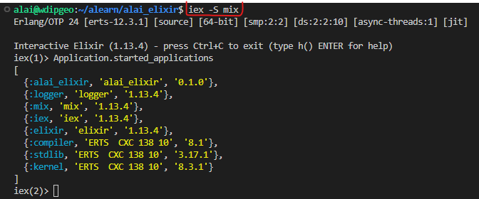

# AlaiElixir

**LEARN ELIXIR**
----------------

## Installation

If [available in Hex](https://hex.pm/docs/publish), the package can be installed
by adding `alai_elixir` to your list of dependencies in `mix.exs`:

```elixir
def deps do
  [
    {:alai_elixir, "~> 0.1.0"}
  ]
end
```

Documentation can be generated with [ExDoc](https://github.com/elixir-lang/ex_doc)
and published on [HexDocs](https://hexdocs.pm). Once published, the docs can
be found at <https://hexdocs.pm/alai_elixir>.


user@machine:~/alearn$ `mix new alai_elixir`
------------------------------------------------

cd alai_elixir

`mix test`
--------------
```shell
iex -S mix
```


user@machine:~/alearn/alai_elixir$ `mix release`
------------------------------------------------

Compiling 1 file (.ex)
Generated alai_elixir app
* assembling alai_elixir-0.1.0 on MIX_ENV=dev
* skipping runtime configuration (config/runtime.exs not found)

Release created at _build/dev/rel/alai_elixir!

    # To start your system
    _build/dev/rel/alai_elixir/bin/alai_elixir start

Once the release is running:

    # To connect to it remotely
    _build/dev/rel/alai_elixir/bin/alai_elixir remote

    # To stop it gracefully (you may also send SIGINT/SIGTERM)
    _build/dev/rel/alai_elixir/bin/alai_elixir stop

To list all commands:

    _build/dev/rel/alai_elixir/bin/alai_elixir